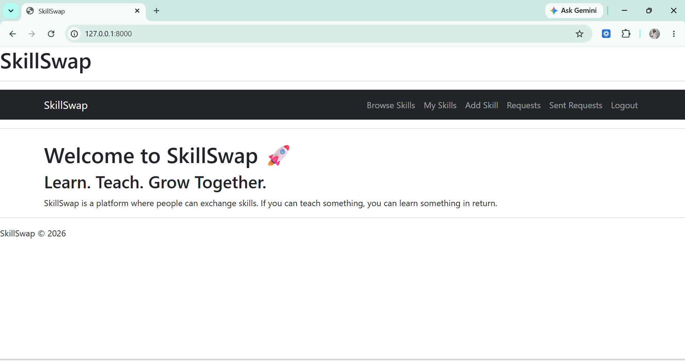
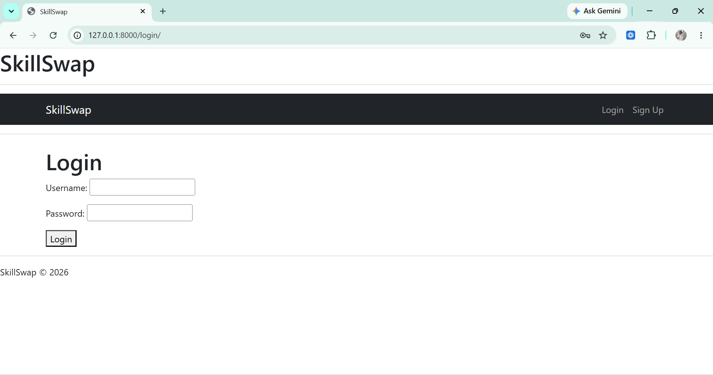
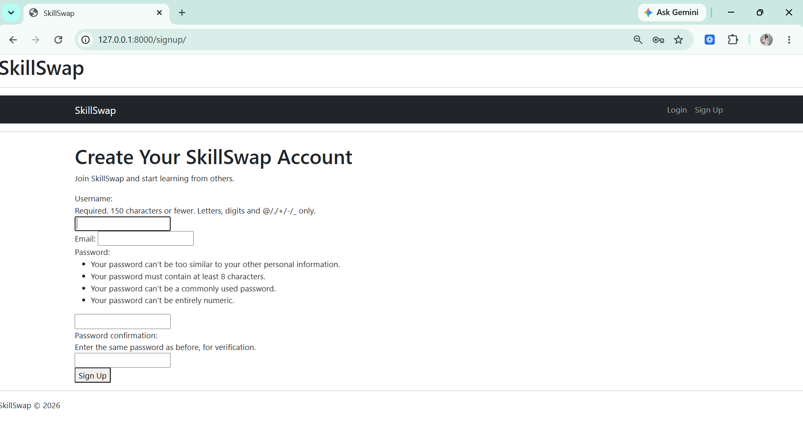
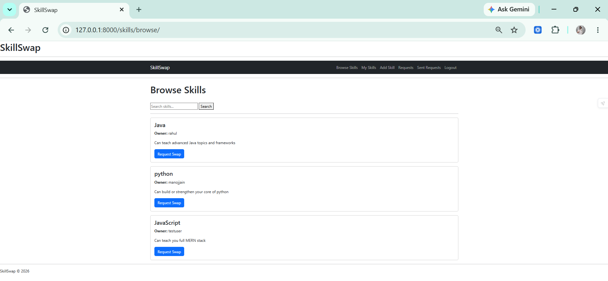
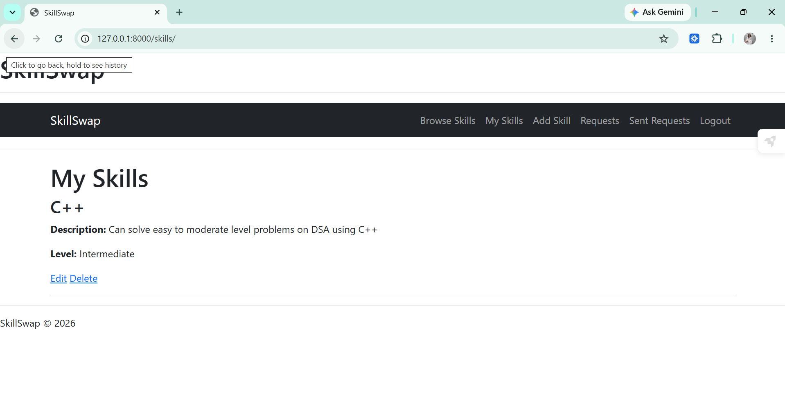
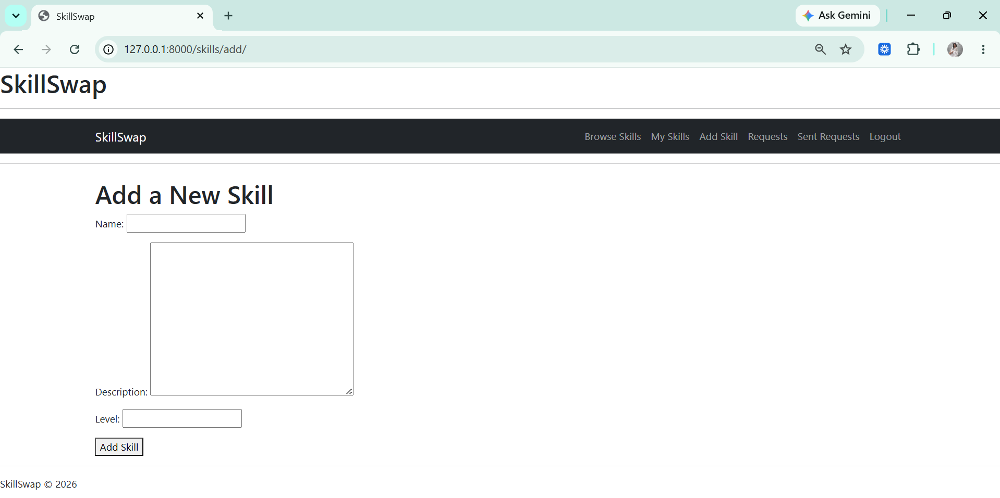
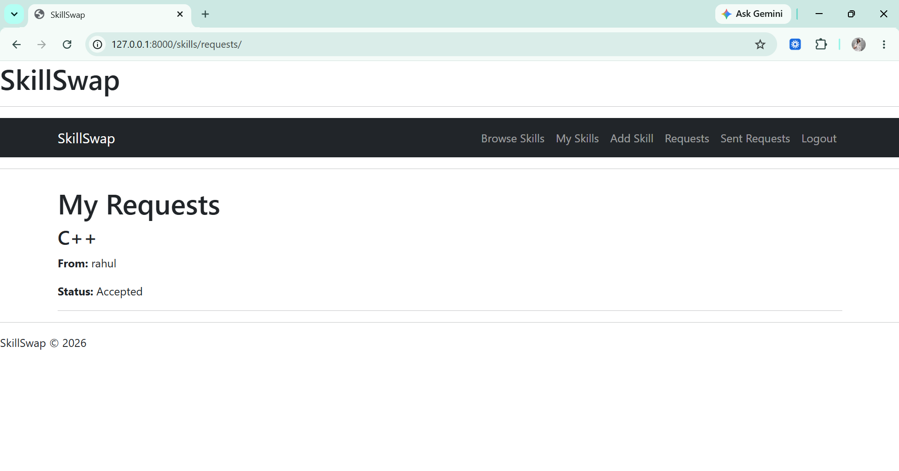

# 🚀 # SkillSwap - A Django Skill Exchange Platform

A full-stack Django web application where users can share their skills, discover skills from others, and request skill exchanges.

Built using **Python, Django, Bootstrap 5, and SQLite**.

---
## 🌐 Live Demo

🔗 https://skillswap-ezax.onrender.com


## ✨ Features

- 🔐 User Authentication (Sign Up, Login, Logout)
- 👤 User Profile Management
- ➕ Add Skills
- ✏️ Edit Skills
- 🗑️ Delete Skills
- 🌍 Browse Skills from Other Users
- 🔍 Search Skills
- 🤝 Send Skill Swap Requests
- ✅ Accept Requests
- ❌ Reject Requests
- 📥 View Incoming Requests
- 📤 View Sent Requests
- 📱 Responsive Bootstrap 5 Interface

---

## 🛠️ Tech Stack

- Python 3
- Django
- Bootstrap 5
- HTML5
- CSS3
- SQLite
- Git
- GitHub

---

## 📸 Screenshots

### 🏠 Home Page



---

### 🔑 Login Page



---

### 📝 Sign Up Page



---

### 🌍 Browse Skills



---

### 📚 My Skills



---

### ➕ Add Skill



---

### 📥 Incoming Requests



---

### 📤 Sent Requests


---

## 📂 Project Structure

```text
SkillSwap/
│
├── skills/
│   ├── models.py
│   ├── views.py
│   ├── forms.py
│   ├── urls.py
│   └── templates/
│
├── users/
│   ├── models.py
│   ├── views.py
│   ├── forms.py
│   ├── urls.py
│   └── templates/
│
├── screenshots/
│   ├── home.png
│   ├── login.png
│   ├── signup.png
│   ├── browse_skills.png
│   ├── my_skills.png
│   ├── add_skill.png
│   ├── incoming_requests.png
│   └── sent_requests.png
│
├── manage.py
├── db.sqlite3
├── requirements.txt
├── README.md
└── .gitignore
```

---

## ⚙️ Installation

Clone the repository:

```bash
git clone https://github.com/coderishani/SkillSwap.git
```

Move into the project directory:

```bash
cd SkillSwap
```

Create a virtual environment:

```bash
python -m venv venv
```

Activate the virtual environment:

### Windows

```bash
venv\Scripts\activate
```

Install dependencies:

```bash
pip install -r requirements.txt
```

Run migrations:

```bash
python manage.py migrate
```

Start the development server:

```bash
python manage.py runserver
```

Open your browser and visit:

```
http://127.0.0.1:8000/
```

---

## 🚀 Future Improvements

- User profile pictures
- Skill categories
- Ratings and reviews
- Chat between users
- Email notifications
- Deployment on Render or PythonAnywhere

---

## 👩‍💻 Author

**Ishani Jain**

- GitHub: https://github.com/coderishani

---

⭐ If you found this project interesting, consider giving it a star!
